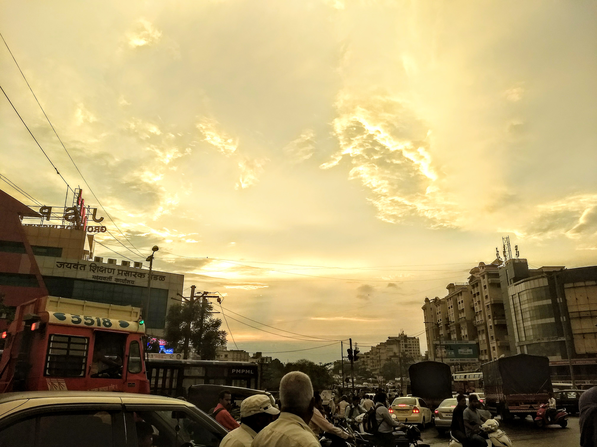
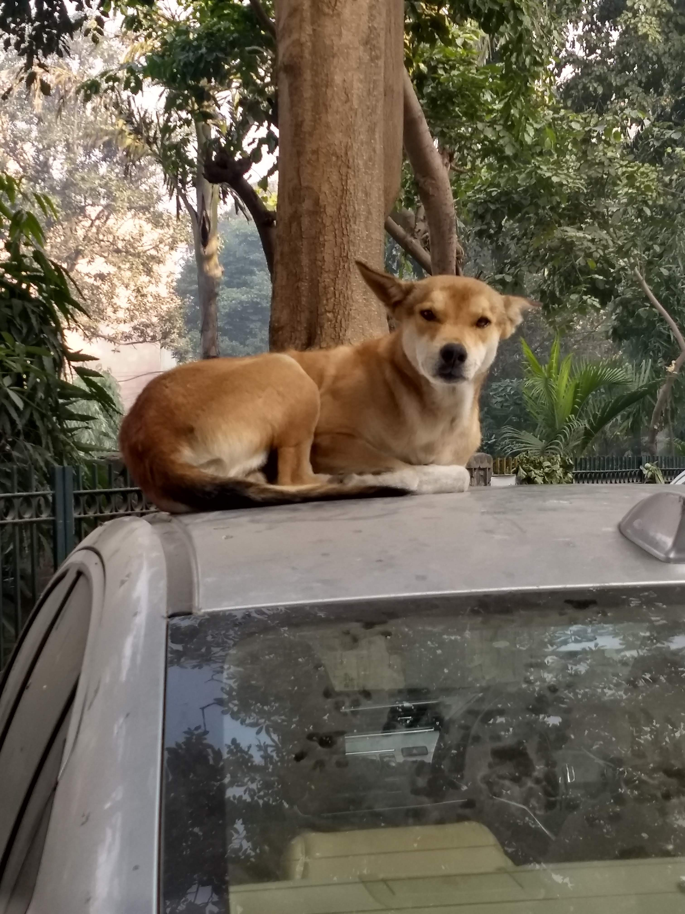
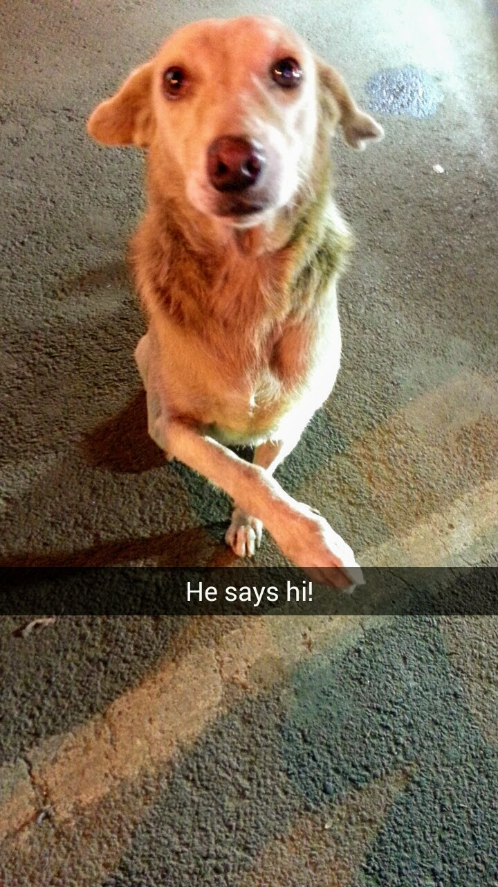

## Hi!
I'm Tanisha Khurana, and in this section I'm going to tell you a little about myself. Why? you may ask? I have no clue. But since you're already here and already wasted this much time, why not read the whole thing.

An electronics and communication engineer, I loved the idea of building just about anything. Getting my hands on IC's, making my first PCB (printed circuit board), I loved it all. I was interested in embedded systems, micro controllers, VLSI Design and then actually coding the FPGA's and 8051 and PIC.  
But as my studies progressed, I also started liking other subjects such as Digital Image Processing and Artificial Intelligence and Robotics.
I took a few workshops on Machine Learning and also did a few online courses such as Machine Learning by Andrew Ng and Deep Learning.ai in the beginning. 

My last year college project dealt with sensors such as turbidity,temperature and sending and displaying the results with GSM module via an SMS, and what made me so fascinated were the real world applications and how we can integrate such data with the modern technology. That is why the first company I joined was a startup incubated in the Delhi University which dealt with building exoskeletons. These devices were made at affordable prices for the general Indian public and what really intrigued me was the thought that with enough data we could scale the operation and make it totally autonomous.
Working with Arduino and sensors such as accelerometers, linear actuators, DC motors, H-drivers for connecting the motors and the battery.

I then joined a company which dealt with integrating both the sensors and the prediction part. This worked with predicting and doing analysis and forecasting whenever any anomaly occurs with the help of the sensors. 
In this company I dealt with having a large influx of data, understood the functioning and troubleshooting and actually sending the results to AWS storage serviice S3, deploying the database and using the timestamps, log file containing valuable information regarding whether the machine is fuctioning correctly, load tecting of EC2, cost analysis

I was also involved as an intern in working with convolutional neural networks, Resnet-30 and Yolo (You Only Look Once)algorithm and using the dataset to correctly analyse face feautures such as age, gender, etc by the dataset given by the Delhi Police. 
I came to know about the whole data cleaning and collection part. Since we also took images from the internet to detect malicious activity, such as people who are crouching or weapon detection, taking images of people with guns and this system was then used in the Republic day parade for any terrorist activity or threat.

The truly important bit is how our work measures and impacts in the long run. Are we doing anything to help the society, the environment? I look  forward to working where I leave a mark, it doesn't have to be huge, just a little to show my contribution. _ I want to do my part _

That's all for now, I'll update when I have learnt a little more and have more stories to tell. 

Untill then here are some images I took which I really like. 

    

 
